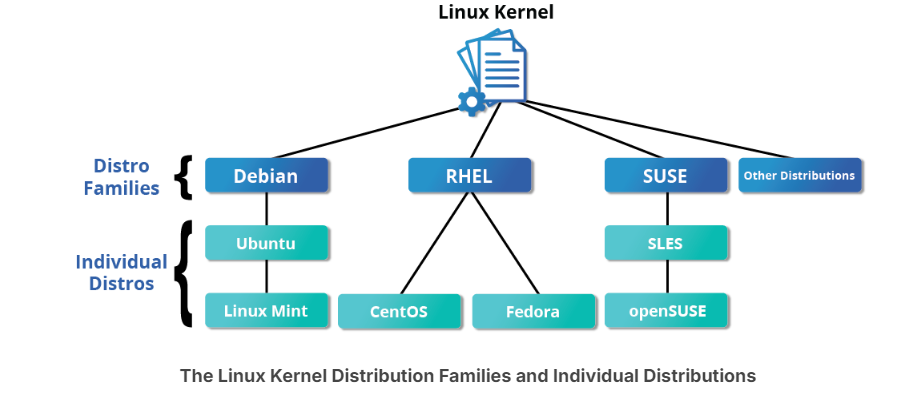
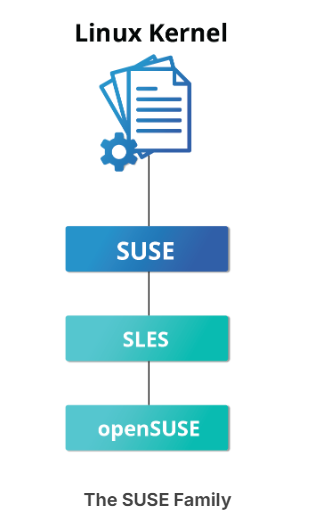
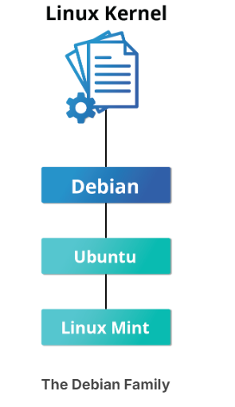

# Three Major Linux Distribution Families

For a rather long list of available distributions, see The LWN.net Linux Distribution List.

# Key Facts About the Red Hat Family
- Fedora serves as an upstream testing platform for RHEL.
- CentOS is a close clone of RHEL; in fact, CentOS has been part of Red Hat since 2014.
- A heavily patched version 4.18 kernel is used in RHEL/CentOS 8 Stream, while version 5.14 is used in RHEL/CentOS 9 Stream.

- It supports multiple hardware platforms.
- It uses dnf, the RPM-based package manager (covered in detail later) to install, update, and remove packages in the system.
- RHEL is widely used by enterprises which host their own systems.

# The SUSE Family

The relationship between SUSE  (SUSE Linux Enterprise Server, or SLES) and openSUSE is similar to the one described between RHEL, CentOS, and Fedora.

# Key Facts About the SUSE Family

- SUSE Linux Enterprise Server (SLES) is upstream for openSUSE.
- Kernel version 5.14 is used in openSUSE Leap 15.4.
- It uses the RPM-based zypper package manager (we cover it in detail later) to install, update, and remove packages in the system.
- It includes the YaST (Yet Another Setup Tool) application for system administration purposes.
- SLES is widely used in retail and many other sectors.

# The Debian Family

The Debian distribution is upstream for several other distributions, including Ubuntu. In turn, Ubuntu is upstream for Linux Mint and a number of other distributions. It is commonly used on both servers and desktop computers. Debian is a pure open source community project (not owned by any corporation) and has a strong focus on stability.

Debian provides by far the largest and most complete software repository to its users of any Linux distribution.

# Key Facts About the Debian Family

- The Debian family is upstream for Ubuntu, and Ubuntu is upstream for Linux Mint and others.
- Kernel version 5.19 is used in Ubuntu 22.04 LTS.
- It uses the DPKG-based APT package manager (using apt, apt-get, apt-cache, etc., which we cover in detail later) to install, update, and remove packages in the system.
- Ubuntu has been widely used for cloud deployments.
- While Ubuntu is built on top of Debian and is GNOME-based under the hood, it differs visually from the interface on standard Debian, as well as other distributions.