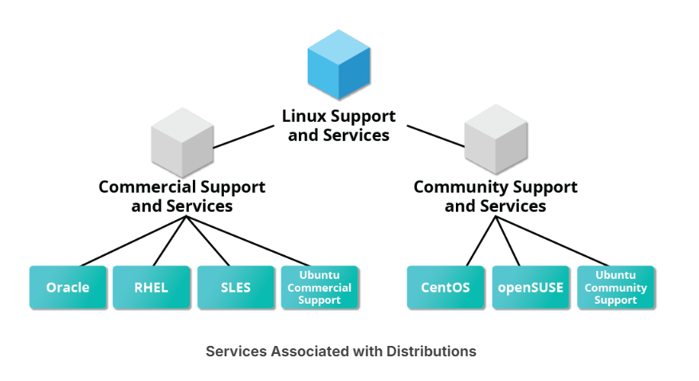

# Services Associated with Distributions

Linux distributions cater to various audiences and needs, with large organizations often choosing commercially-supported options like Red Hat, SUSE, and Ubuntu. Free alternatives like CentOS and CentOS Stream (replaced by CentOS Stream in 2021) are popular among those comfortable without paid support, while Alma Linux and Rocky Linux have emerged as new RHEL-based options. RHEL variants, including CentOS and AlmaLinux, ensure compatibility with RHEL software. Ubuntu and Fedora are favored by developers and educational institutions. Major distributors offer long-term support, updates, and certifications to keep systems secure and efficient.

# Chapter Summary
- Linux borrows heavily from the UNIX operating system, with which its creators were well-versed.
- Linux accesses many features and services through files and file-like objects.
- Linux is a fully multi-tasking, multi-user operating system, with built-in networking and service processes known as daemons.
- Linux is developed by a loose confederation of developers from all over the world, collaborating over the Internet, with Linus Torvalds at the head. Technical skill and a desire to contribute are the only qualifications for participating.
- The Linux community is a far reaching ecosystem of developers, vendors, and users that supports and advances the Linux operating system.
- Some of the common terms used in Linux are: kernel, distribution, boot loader, service, filesystem, X Window system, desktop  environment, and command line.
- A full Linux distribution consists of the kernel plus a number of other software tools for file-related operations, user management, and software package management.
