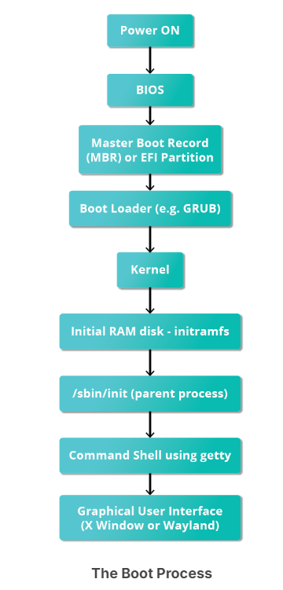
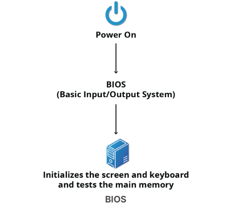

# The Boot Process 

The Linux boot process is the procedure for initializing the system. It consists of everything that happens from when the computer power is first switched on until the user interface is fully operational. 

# BIOS - The First Step 
Linux can run on various hardware, but we'll focus on the x86 family, common in most PCs. When an x86-based Linux system starts, the BIOS initializes the hardware, such as the screen and keyboard, and tests the main memory in a process called POST (Power On Self Test).

