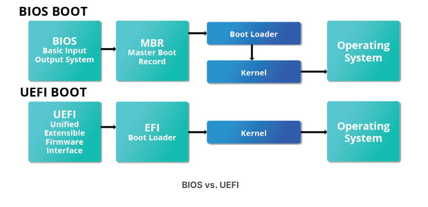

# The Boot Process 

The Linux boot process is the procedure for initializing the system. It consists of everything that happens from when the computer power is first switched on until the user interface is fully operational. 

# BIOS - The First Step 
Linux can run on various hardware, but we'll focus on the x86 family, common in most PCs. When an x86-based Linux system starts, the BIOS initializes the hardware, such as the screen and keyboard, and tests the main memory in a process called POST (Power On Self Test).

# Master Boot Record (MBR), EFI Partition, and Boot Loader
After the POST is completed, system control moves from the BIOS to the boot loader, which is stored on a storage device like a hard disk or SSD. For older systems, it’s in the boot sector; for newer UEFI systems, it’s in the EFI partition. Up to this point, no mass storage is accessed. Then, the system loads date, time, and key peripheral info from the CMOS, which keeps track of these even when the system is off.

A number of boot loaders exist for Linux; the most common ones are GRUB (for GRand Unified Boot loader), ISOLINUX (for booting from removable media), and DAS U-Boot (for booting on embedded devices/appliances). Most Linux boot loaders can present a user interface for choosing alternative options for booting Linux and even other operating systems that might be installed. When booting Linux, the boot loader is responsible for loading the kernel image and the initial RAM disk or filesystem (which contains some critical files and device drivers needed to start the system) into memory.

# Boot Loader in Action 