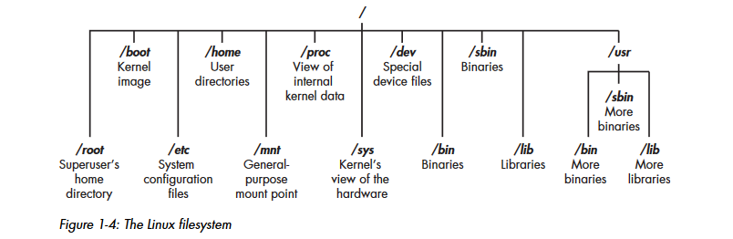

# Chapter 1 Notes 

# Getting Started:
- Installed Git - Git is a tool that helps you keep track of changes in your files and collaborate with others on projects. It saves different versions of your files so you can go back to an earlier version if needed, and it allows multiple people to work on the same project without overwriting each other’s work
- Created linuxbasic directory on local machine (mkdir)
- Created linuxbasics repo in github
- Ran these commands:
    - git init #this initializing the folder
    - git add .  #this adds all contents in that folder
    - git commit -m "inital commit" #adds all files to branch
    - git branch -M main #this sets the branch name
    - git remote add origin https://gitgub.com/cameronxdx/(example.git)  #adds a remote called origin to the remote repo url specified
    - git pull https://github.com/cameronxdx-cloud/azure-cloud-resume-challenge.git main --allow-unrelated-histories (only add if they are unrelated
    - git push -u origin main #this pushes to the branch
- Deployed Kalilinux VM

# Terms:
* Binaries - files that can executed residing in the /usr/bin or usr/sbin directory
    - ps 
    - cat 
    - ls 
    - ifconfig
* Case sensitivity - always lower case 
* Directory - Organization of folder/files structures
* root - administrator/superuser
* Script - commands run by interpreters like Python, converting each line to source code, and are commonly used in hacking tools
* Shell - Bash is a program in Linux that lets you run commands and scripts easily

# Filesystem Structure:

- /root The home directory of the all-powerful root user
- /etc Generally contains the Linux configuration files—files that control when and how programs start up
- /home The user’s home directory
- /mnt Where other filesystems are attached or mounted to the
filesystem
- /media Where CDs and USB devices are usually attached or mounted
to the filesystem
- /bin Where application binaries (the equivalent of executables in
Microsoft Windows or applications in macOS) reside
- /lib Where you’ll find libraries (shared programs that are similar to
Windows DLLs)

# Basic Linux Commands:
- 